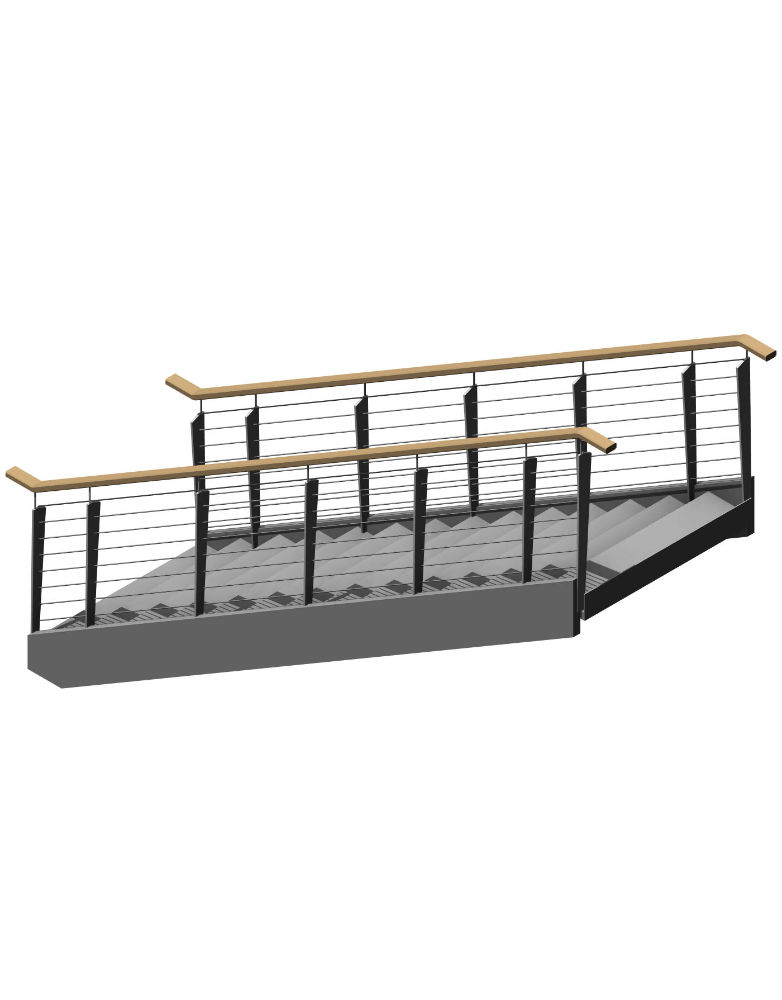

# Issue #14: send-code stair verification

Recorded on 2026-09-22 against source commit `f35a9575362a9eafbac6e381363ee6751c2e1406`. These additions are unreleased; v0.6.1 does not contain the new source builder or `SafeFailuresPreprocessor`.

## Retained Revit 2027 demo

The [exact executed C# payload](create-stair-snowdon-2027.cs) created one real stair and an isolated 3D view using only `revit_send_code_to_revit`. The transaction group was assimilated, not rolled back. Revit then exported this image and saved a separate local RVT through further send-code calls. The Autodesk sample file was not overwritten. The RVT is not included in this repository.

| Observation | Result |
|---|---|
| Host | Revit 2027, build 27.0.10.13 |
| Fixture | Snowdon Towers Sample Architectural |
| Stair / run IDs | 3327759 / 3327760 |
| View | Issue14 - Send-code Stair Demo (3327821) |
| Stair count before / after | 26 / 27 |
| Risers / actual riser height | 15 / 164.2533 mm |
| Total height / actual tread depth | 2,463.8 mm / 280 mm |
| Actual run width, read back from Revit | 1,200 mm |
| Helper result | committed; HadWarnings=false; HadErrors=false; Messages=[] |
| After SaveAs | File exists; IsModified=false; IsModifiable=false |

The payload is a **fixture-specific regression example**, not a general stair generator: it uses existing level/type IDs in the named 2027 sample, places the stair at internal coordinates (1000, 1000) feet away from the building, and rejects a duplicate demo view. Use the unmodified sample with the updated plugin to repeat it. The example retains its changes; use Undo or a separate copy for testing. Other models require validated levels, types, and placement. Its `.Value` IDs target Revit 2027. No-warning persistence is not a design or code-compliance certification.

The fresh process loaded the deployed `RvtMcp.Plugin.dll`, with the helper in that same assembly (no diagnostic helper assembly):

- SHA-256: `FE096A7037643AA795BA163BE0CE04908C93C8B7CD0C120AE105E329115438BC`
- Module ID: `8f2d1f8e-4cc0-4322-a790-88a61273dc17`

## Validation and limits

| Check | Evidence |
|---|---|
| Automated tests | 484 passed, including source-builder compile/execute tests |
| Plugin builds | All years 2022–2027, deployment disabled for build verification |
| Live Revit 2022 | Diagnostic probes of source forms, valid stair, warning reporting, injected Error rollback, and exception cleanup |
| Fresh deployed Revit 2027 | Plain body; `class ` in comments/strings; mixed helper declarations; full-source and body-plus-IFailuresPreprocessor forms all passed |
| 2027 valid stair | Committed; no warnings/errors; scope closed |
| 2027 tread depth of 100 mm | Warning, not Error; committed_with_warnings with message preserved |
| 2027 injected registered Error | Inner transaction rolled back; HadErrors=true; no retained stair |
| 2027 Commit(null) and deliberate geometry-path exception | finally cancelled the active scope; a subsequent scope could start |

Diagnostic stair probes used outer-group rollback; only the separately illustrated demo was retained. The connected MCP server kept its existing tool schema/transport; this verifies the deployed plugin, not installation of a newly packaged release.

The original [report](https://github.com/bimwright/rvt-mcp/issues/14) describes Revit 2025 build 25.3.0.0 and an Error-severity tread failure followed by a crash. That failure has not been reproduced. The injected Error tests establish the tested rollback path only. An earlier local Revit 2027 session also crashed; its cause remains undetermined. Passing the fresh-session probes does not resolve that crash attribution or prove recovery from arbitrary native crashes.

## Next push and issue follow-up

- [ ] Push the implementation and this verification record when the owner next requests a push.
- [ ] After that push succeeds, post the draft below on #14, linking the pushed commit and this record. Do not describe the change as a published release until one exists.
- [ ] Obtain Revit 2025 reporter confirmation or equivalent reproduction before claiming the reported crash fixed.
- [ ] Resolve or explicitly track the separate native `create_stairs` feature request before closing the whole issue. No native stair tool was added here.

Draft comment for posting **after the push**, not posted as part of this verification:

> The send-code source wrapper now accepts helper type declarations alongside the function body, including an `IFailuresPreprocessor`, without Reflection.Emit. We also added an opt-in `RvtMcp.Plugin.SafeFailuresPreprocessor`: it records warnings, deletes them from failure processing, and requests rollback on errors. The documented caller preserves warning messages and uses finally/Cancel to clean up an active stairs edit scope after exceptions.
>
> Source: [f35a957](https://github.com/bimwright/rvt-mcp/commit/f35a9575362a9eafbac6e381363ee6751c2e1406). [Documentation](https://github.com/bimwright/rvt-mcp/blob/master/docs/send-code.md) and [tested payload + screenshot](https://github.com/bimwright/rvt-mcp/blob/master/docs/testing/issue-14/README.md). These changes are in source and are not yet included in a published release.
>
> We validated the tested paths on Revit 2022 and a fresh Revit 2027 process with the updated plugin. We also retained and saved a real 15-riser stair created entirely through send-code on 2027, with a 280 mm tread and 1,200 mm width, without reported warnings/errors. A 100 mm tread was a Warning in our fixtures; the Error rollback test used an explicitly injected Error. We have therefore not reproduced or confirmed the fix for your Revit 2025 crash. Could you share the failing script and a minimal model, or confirm the behavior once the updated plugin is available?
>
> Your request to consider a native `create_stairs` tool is also recorded. This change provides the send-code path; it does not add that dedicated tool.
